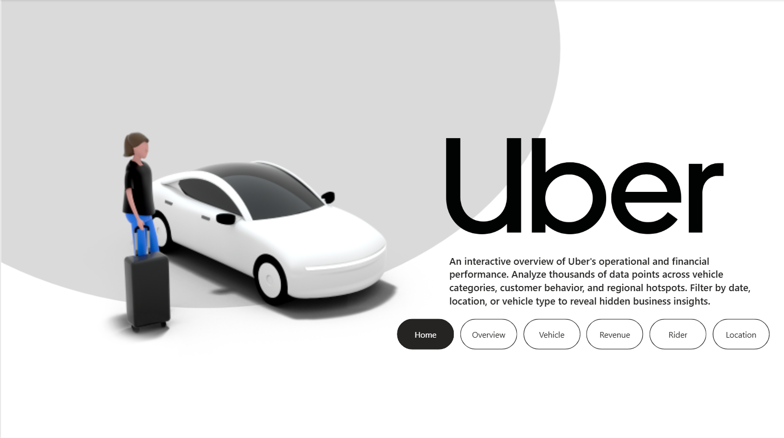
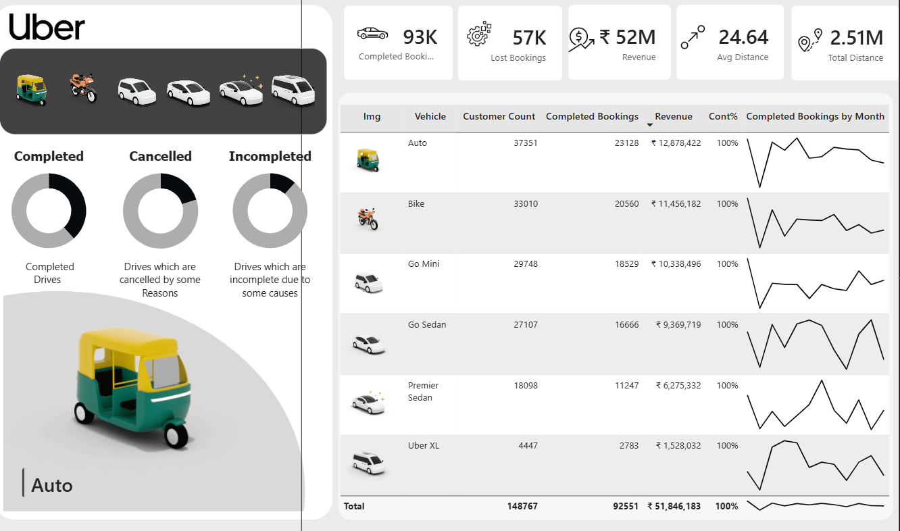
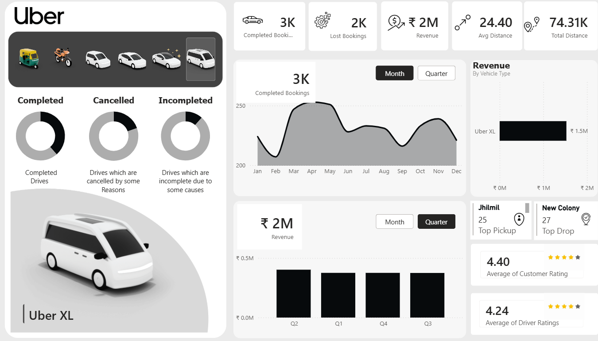
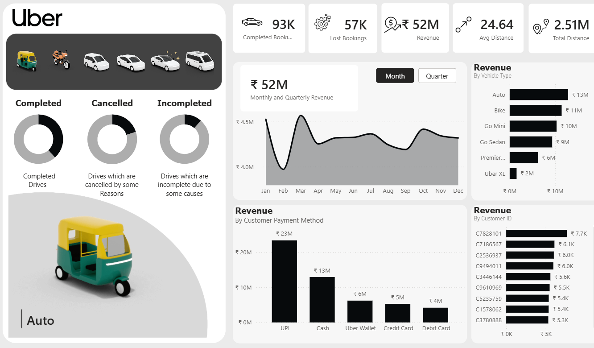

# 🚗 Uber Operational & Financial Analytics Dashboard

> An end-to-end analytics project analyzing **148K+ rides** across vehicle tiers, customer behavior, cancellation patterns, and geospatial hotspots — built with SQL and Power BI.

---

## 📌 Table of Contents

- [Executive Summary](#executive-summary)
- [Business Problem](#business-problem)
- [Dashboard Preview](#dashboard-preview)
- [Methodology](#methodology)
- [Key Metrics](#key-metrics)
- [Insights & Business Recommendations](#insights--business-recommendations)
- [SQL Queries Overview](#sql-queries-overview)
- [Skills Demonstrated](#skills-demonstrated)
- [Next Steps](#next-steps)
- [Repository Structure](#repository-structure)

---

## Executive Summary

Uber's ride-hailing operations span multiple vehicle tiers and geographic zones, yet critical decisions around **driver incentives, cancellation management, and peak-hour strategy** often lack data backing.

This project delivers a full analytical pipeline — from raw SQL extraction to an interactive Power BI dashboard — to answer: *which vehicles drive value, when and where rides peak, and what's causing revenue leakage through cancellations.*

**Core finding:** While "Auto" and "Go Mini" dominate ride volume, premium vehicles quietly equalize total revenue. Meanwhile, cancellation rates above 20% for the most popular tiers represent a significant and addressable business risk.

---

## Business Problem

Uber needed actionable visibility into the following operational questions:

- Which vehicle types generate the most **revenue vs. raw volume** — and are they the same?
- What are the primary drivers of **ride cancellations**, and who is responsible?
- How do **time of day and geography** influence average booking values and surge pricing?
- Are operational inefficiencies (e.g., drivers refusing to move toward pickup) causing measurable **revenue leakage?**

---

## Dashboard Preview

| Home Page | Vehicle Overview |
|-----------|-----------------|
|  |  |

| Overview Tab | Revenue Tab |
|-------------|-------------|
|  |  |

> The dashboard contains 5 interactive tabs: **Home · Overview · Vehicle · Revenue · Rider · Location**  
> Filters available by Vehicle Type, Customer ID, Booking Status, and Time Period.

---

## Methodology

### 1. Data Extraction & KPI Formulation — SQL

- Queried aggregate business metrics: total rides, revenue, average fares, and ride distances
- Segmented vehicle performance to compare volume, revenue, and average rating per tier
- Categorized and quantified cancellation reasons (driver-initiated vs. customer-initiated) to isolate operational bottlenecks
- Extracted geospatial pickup rankings and hourly booking patterns for temporal analysis

### 2. Exploratory Data Analysis

- Analyzed volume vs. value parity across all six vehicle categories
- Mapped peak ride volume against average booking value by hour to identify surge windows
- Generated a correlation heatmap to test relationships between numerical variables (distance, rating, fare)
- Identified that ride distance does **not** linearly predict customer ratings — qualitative factors dominate

### 3. BI Dashboard Development — Power BI

- Built an interactive 5-tab dashboard with real-time filter controls
- Visualized KPIs including 93K completed bookings, ₹52M in revenue, and 2.51M KM total distance
- Designed dedicated analytical views for Vehicle, Revenue, Rider behavior, and Location hotspots
- Embedded sparklines per vehicle type to show monthly booking trends at a glance

---

## Key Metrics

| Metric | Value |
|---|---|
| ✅ Completed Bookings | 93,000 |
| ❌ Lost Bookings | 57,000 |
| 💰 Total Revenue | ₹52M |
| 📍 Total Distance | 2.51M KM |
| 📏 Avg Distance per Ride | 24.64 KM |
| ⭐ Avg Customer Rating | 4.40 |
| 🚗 Avg Driver Rating | 4.24 |

---

## Insights & Business Recommendations

### Major Insights

**🔄 Completion & Cancellation Patterns**  
The majority of rides complete successfully. Among cancellations, driver-initiated ones rank second — primarily due to capacity violations ("More than permitted people"), customer disputes, and personal or car-related issues. Customer cancellations mostly stem from changed plans, wrong addresses, or drivers failing to move toward the pickup point.

**⚖️ Volume vs. Value Parity**  
"Auto" (37K customers, ₹12.8M revenue) and "Bike" (33K customers, ₹11.4M revenue) dominate volume. However, premium tiers like "Premier Sedan" and "Uber XL" command significantly higher fares per ride — resulting in a surprisingly balanced revenue contribution across all vehicle categories.

**🚦 Vehicle Reliability Disparity**  
"Auto" and "Bike" suffer cancellation rates above 20%, severely degrading the customer experience for the most popular tiers. Premium options like "Uber XL" have the lowest cancellation rates (under 18%), making them the most reliable option despite lowest volume.

**⏰ Commuter Volume vs. High-Value Windows**  
Ride volume mirrors corporate commute patterns (7–11 AM and 4–9 PM). However, **average booking value** peaks in the early morning (5–6 AM) — attributed to low driver supply and high-value airport runs — and again post-10 PM. The evening commute (5–8 PM) shows moderate surge pricing activity.

**📍 Geospatial Hotspots**  
The five busiest pickup zones are concentrated in major commercial and transit hubs:
**Khandsa · Barakhamba Road · Saket · Badarpur · Pragati Maidan**

**📊 Variable Independence**  
A correlation heatmap confirmed no strong linear relationships between numerical variables. Ride distance does not predict customer ratings, meaning ratings are driven by qualitative factors such as driver behavior and vehicle condition — not trip length.

---

### Business Recommendations

**1. Fix "Auto" and "Bike" Reliability**  
With cancellation rates above 20% on the highest-volume tiers, this is the single largest addressable operational risk. Investigate complaints about drivers not moving toward pickup. Consider a proximity-based penalty for drivers who accept but idle, or a small fare completion incentive.

**2. Target Off-Hour Driver Supply**  
Average fares peak at 5 AM and post-10 PM. Deploying targeted driver incentives during these windows captures high-value trips (especially airport runs) and rebalances the supply-demand curve with minimal cost.

**3. Surge Reallocation to Hotspots**  
Concentrate driver incentives in Khandsa, Barakhamba Road, and Saket during peak hours (7–11 AM and 4–9 PM). This directly targets the intersection of maximum demand and highest cancellation risk.

**4. Premium Vehicle Growth Strategy**  
Uber XL delivers comparable revenue at a fraction of the volume, with the best reliability scores. Targeted weekend promotions for group travel could spike XL adoption and meaningfully lift top-line revenue without expanding low-tier supply.

---

## SQL Queries Overview

The project is organized into five analytical sections:

| Section | Queries Covered |
|---------|----------------|
| **Overall Business KPIs** | Aggregate metrics, successful ride revenue |
| **Vehicle Performance & Ratings** | Revenue by vehicle, avg distance, avg ratings, driver rating range |
| **Customer Behavior & Payments** | Top customers by volume, payment method breakdown, UPI rides |
| **Cancellations & Bottlenecks** | Cancellation by actor, cancellation reasons, incomplete rides |
| **Geospatial & Temporal Analysis** | Top 10 pickup locations, hourly volume & average fare |

Full queries available in [`SQL\uber_analysis_queries.sql`](SQL\uber_analysis_queries.sql)

---

## Skills Demonstrated

| Category | Tools & Techniques |
|---|---|
| **Data Extraction** | SQL — aggregations, filtering, window functions, subqueries |
| **EDA** | Statistical analysis, correlation heatmaps, temporal trend analysis |
| **BI & Visualization** | Power BI — DAX KPIs, interactive slicers, sparklines, multi-tab layout |
| **Business Strategy** | Translating data patterns into operational and revenue recommendations |
| **Domain Knowledge** | Ride-hailing economics, surge pricing mechanics, geospatial demand modeling |

---

## Next Steps

- Build **probabilistic forecasting models** for surge pricing demand based on historical temporal data
- Develop **customer segmentation** based on payment method preferences and booking frequency
- Add **RFM (Recency, Frequency, Monetary) analysis** for high-value rider retention
- Automate **SQL reporting pipelines** feeding real-time cancellation alerts to operations teams
- Explore **seasonality patterns** to identify month-over-month demand shifts by vehicle type

---

## Repository Structure

```
uber-analytics/
│
├── SQL/
│   └── uber_metrics_queries.sql       # 17 queries across 5 business sections
│
├── PowerBI-Dashboard/
│   └── Uber_Analytics_Dashboard.pbix  # Full interactive dashboard
│
├── Data/
│   └── uber_trips_data.csv            # Raw dataset
│
├── Screenshots/
│   ├── home.png
│   ├── overview.png
│   ├── vehicle.png
│   └── revenue.png
│
└── README.md
```

---

## 🔗 Connect

Built with SQL + Power BI | Domain: Ride-Hailing Operations & Financial Analytics

*If you found this project useful, drop a ⭐ on the repo!*
